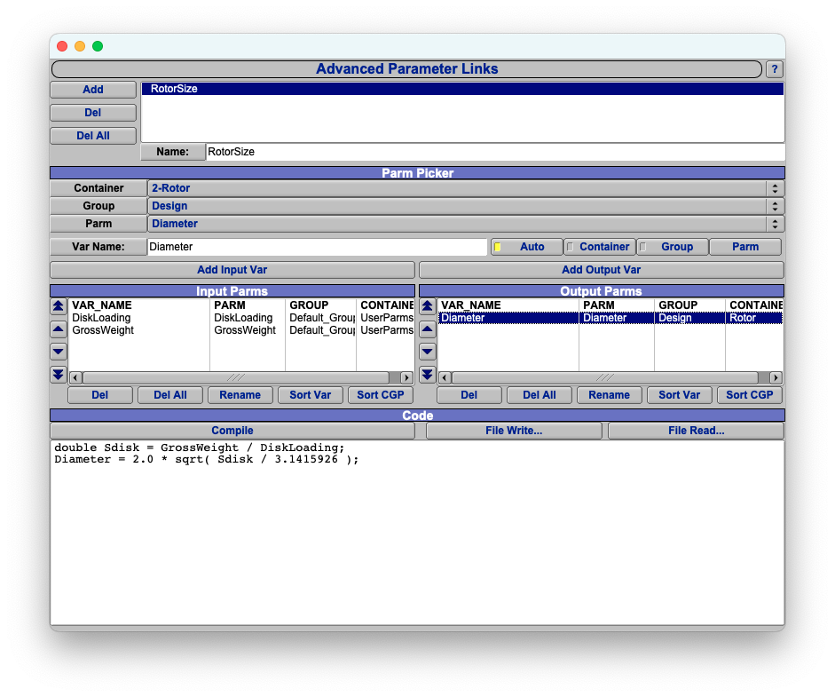

高级参数链接允许用户在任意参数之间定义数学关系。

创建高级链接时，先添加链接并为其设置合适的名称；再选择一个或多个输入参数，分别定义
用作别名的变量名；随后选择输出参数并定义其别名；最后编写代码，说明输出如何依赖输入。

高级链接使用 AngelScript 编写。AngelScript 是 OpenVSP 内嵌的脚本语言，也用于通用脚本和
自定义组件，因此高级链接可以通过 AngelScript 使用完整的 OpenVSP API。

一个典型高级链接如下：



该链接根据桨盘载荷和总重计算飞行器的桨盘直径。OpenVSP 自动将输入变量
`GrossWeight`、`DiskLoading` 和输出变量 `Diameter` 定义为双精度浮点数 `double`。

多数高级链接只包含几行采用标准数学写法、并以分号结尾的代码。可将其看作 AngelScript 的
简化子集，即“带分号的数学表达式”。示例代码如下：

```c++
double Sdisk = GrossWeight / DiskLoading;
Diameter = 2.0 * sqrt( Sdisk / 3.1415926 );
```

## 带分号的数学表达式

OpenVSP 会自动把输入和输出变量定义为 `double`，可用常见数学符号构造算术表达式。

| 数学运算符 | 含义 |
|:-----------|:-----|
| `()` | 表达式分组和优先级控制 |
| `+ -` | 一元正号与负号 |
| `**` | 幂 |
| `* / %` | 乘、除和取模 |
| `+ -` | 二元加与减 |
| `=` | 赋值 |

还可使用一组标准数学函数：

| 数学函数 | 说明 |
|:---------|:-----|
| `cos(x) sin(x) tan(x)` | 三角函数（弧度） |
| `acos(x) asin(x) atan(x) atan2(x)` | 反三角函数（弧度） |
| `cosh(x) sinh(x) tanh(x)` | 双曲函数 |
| `log(x) log10(x)` | 对数函数 |
| `pow(x)` | 幂运算 |
| `sqrt(x)` | 平方根 |
| `abs(x)` | 绝对值 |
| `ceil(x)` | 向上取整 |
| `floor(x)` | 向下取整 |
| `fraction(x)` | 小数部分 |
| `Min(x,y) Max(x,y)` | 两个值的最小值和最大值 |
| `Rad2Deg(x) Deg2Rad(x)` | 角度单位转换 |

支持 C++ 风格的 `//` 行注释和 C 风格的 `/* ... */` 块注释。

## 故障排查

可以使用 `Print()` 函数（注意大写 P）向控制台输出信息。该函数由 OpenVSP API 提供，可直接
处理多种数据类型。小写的 `print()` 是 AngelScript 原生函数，输出数值时需要额外格式化。
调试示例脚本时，可以加入以下语句显示每一步的中间值：

```c++
double Sdisk = GrossWeight / DiskLoading;
Print( "桨盘面积：", false );
Print( Sdisk );
Diameter = 2.0 * sqrt( Sdisk / 3.1415926 );
Print( "桨盘直径：", false );
Print( Diameter );
```

`Print()` 的第二个可选参数控制是否结束当前行并开始新行。传入 `false` 后，后续 `Print()`
会继续在同一行输出。输出会显示在 OpenVSP 主窗口后的控制台，或启动 OpenVSP 的终端中。

## AngelScript 通用编程

如果“带分号的数学表达式”不能满足需求，可以使用 AngelScript 的全部语言功能。
AngelScript 与 C++ 相似，专门设计为嵌入其他 C++ 程序。其
[官方语言文档](https://www.angelcode.com/angelscript/sdk/docs/manual/doc_script.html)可在线查阅。

### 数据类型

由于 OpenVSP 自动把输入和输出定义为 `double`，简单脚本通常不必声明变量。需要中间变量时，
可以使用常见基础类型、AngelScript 的 `string` 和 `array`，以及 OpenVSP API 提供的
`vec3d` 和 `matrix4d`。

| 类型 | 含义 |
|:-----|:-----|
| `bool` | 布尔值 true/false |
| `int` | 32 位有符号整数 |
| `uint` | 32 位无符号整数 |
| `float` | 单精度浮点数 |
| `double` | 双精度浮点数 |
| `string` | 字符串 |
| `array < T >` | T 类型数组 |
| `vec3d` | 三维向量 |
| `matrix4d` | 变换矩阵 |

### 运算符与运算顺序

AngelScript 提供了在 C++ 基础上扩展的完整运算符集合。表达式中优先级最高的运算符先计算；
圆括号可以对表达式分组并覆盖默认优先级。

#### 一元运算符

一元运算符的优先级高于其他运算符；多个一元运算符中，离实际值最近者优先。
后置运算符的优先级高于前置运算符。

| 运算符 | 含义 |
|:-------|:-----|
| `::` | 作用域解析 |
| `[]` | 下标索引 |
| `++ --` | 后置自增与自减 |
| `.` | 成员访问 |
| `++ --` | 前置自增与自减 |
| `not !` | 逻辑非 |
| `+ -` | 一元正号与负号 |
| `~` | 按位取反 |
| `@` | 获取句柄 |

#### 二元和三元运算符

下表按优先级从高到低排列：

| 运算符 | 含义 |
|:-------|:-----|
| `**` | 幂 |
| `* / %` | 乘、除和取模 |
| `+ -` | 加和减 |
| `<< >> >>>` | 左移、右移和算术右移 |
| `&` | 按位与 |
| `^` | 按位异或 |
| `\|` | 按位或 |
| `<= < >= >` | 比较 |
| `== != is !is xor ^^` | 相等、同一性和逻辑异或 |
| `and &&` | 逻辑与 |
| `or \|\|` | 逻辑或 |
| `?:` | 条件运算 |
| `= += -= *= /= %= **= &= \|= ^= <<= >>= >>>=` | 赋值和复合赋值 |

### 控制流

AngelScript 支持 C++ 常见的循环和分支结构。使用时应避免计算开销很大的高级链接，尤其要防止
无限循环。常用结构示例如下：

```c++
if ( condition1 )
{
    // condition1 为真时执行。
}

if ( condition2 )
{
    // condition2 为真时执行。
}
else if ( condition3 )
{
    // condition2 为假、condition3 为真时执行。
}
else
{
    // condition2 和 condition3 都为假时执行。
}

int n = 5;
for ( int i = 0; i < n; i++ )
{
    // 执行五次。
}
```

### 数组

AngelScript 的 `array` 与 C++ STL 的 `vector` 很相似，是支持随机访问的动态容器。

| 方法 | 含义 |
|:-----|:-----|
| `x[i];` | 访问元素 |
| `array < T > x;` | 声明 |
| `array < T > x = {1.2, 2.3, 3.4};` | 声明并初始化 |
| `T[] x;` | 简写声明 |
| `T[] x = {1.2, 2.3, 3.4};` | 简写声明并初始化 |
| `uint size();` | 数组大小 |
| `bool empty();` | 测试数组是否为空 |
| `void push_back( const T &in );` | 在末尾添加值 |
| `void pop_back();` | 删除末尾值 |
| `void insert( uint index, const T &in value );` | 在索引处插入值 |
| `void insert( uint index, const array<T>& arr );` | 在索引处插入数组 |
| `void erase( uint index );` | 删除索引处的值 |
| `void reserve( uint length );` | 预留存储空间 |
| `void resize( uint length );` | 调整数组大小 |
| `void reverse();` | 反转元素顺序 |

### OpenVSP 类型

OpenVSP API 提供的 `vec3d` 和 `matrix4d` 适合处理三维位置、方向向量和变换矩阵。
`vec3d` 支持向量加法、标量乘法、点积、叉积和点投影等运算；请参阅
[完整 vec3d 文档](https://openvsp.org/api_docs/latest/classvec3d.html)。

`matrix4d` 是扩展的变换矩阵，用于三维旋转、平移、缩放、投影及其他变换；请参阅
[完整 matrix4d 文档](https://openvsp.org/api_docs/latest/class_matrix4d.html)。

### OpenVSP API

高级链接可以使用完整的 OpenVSP API。请参阅
[OpenVSP API 文档](https://openvsp.org/api_docs/latest/)。

### AngelScript API

请参阅官方 [AngelScript 语言文档](https://www.angelcode.com/angelscript/sdk/docs/manual/doc_script.html)。
OpenVSP 安装的可选模块如下：

| AngelScript 模块 | 用途 |
|:-----------------|:-----|
| `stdstring` | [字符串对象](https://www.angelcode.com/angelscript/sdk/docs/manual/doc_script_stdlib_string.html) |
| `array` | [数组模板对象](https://www.angelcode.com/angelscript/sdk/docs/manual/doc_datatypes_arrays.html) |
| `any` | [通用容器](https://www.angelcode.com/angelscript/sdk/docs/manual/doc_addon_any.html) |
| `file` | [文件输入/输出](https://www.angelcode.com/angelscript/sdk/docs/manual/doc_script_stdlib_file.html) |
| `math` | [数学函数](https://www.angelcode.com/angelscript/sdk/docs/manual/doc_addon_math.html) |
| `builder` | [脚本构建器](https://www.angelcode.com/angelscript/sdk/docs/manual/doc_addon_build.html) |
| `filesystem` | [文件系统](https://www.angelcode.com/angelscript/sdk/docs/manual/doc_script_stdlib_filesystem.html) |
| `datetime` | [日期与时间](https://www.angelcode.com/angelscript/sdk/docs/manual/doc_script_stdlib_datetime.html) |
| `aswrappedcall` | [自动包装器](https://www.angelcode.com/angelscript/sdk/docs/manual/doc_addon_autowrap.html) |
| `stdstring_utils` | [字符串工具](https://www.angelcode.com/angelscript/sdk/docs/manual/doc_script_stdlib_string.html) |

注意：OpenVSP 编译 AngelScript 时启用了 `#define AS_USE_STLNAMES=1`，使 `stdstring` 和
`array` 的行为更接近 C++ STL。

注意：OpenVSP 注册 `array` 包时启用了 `defaultArray=true`，因此可以使用 `T[] arr;` 形式声明数组。
