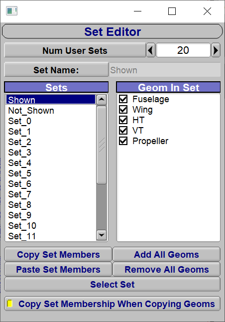
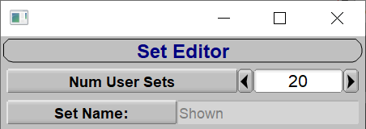
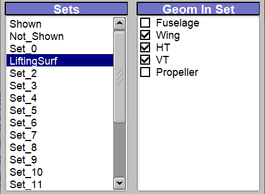
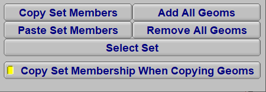

OpenVSP 的“集合”用于将多个组件分组，并对其执行显示/隐藏、导出和分析等操作。
集合编辑器可以快速向集合添加组件、从集合移除组件，以及在不同集合之间复制成员。
默认集合名称可以修改，也可以增加可用集合的数量；还可以直接在集合编辑器中选择
某个集合包含的组件。

可从“模型”菜单打开集合编辑器，界面如下：

## 集合编辑器顶部

顶部包含“用户集合数”和“集合名称”两个控件。可以增加模型中可用的集合数量，
但集合总数不能少于 20。“集合名称”输入框显示当前选中的集合，并允许输入新名称。
注意，“Shown”和“Not_Shown”是受保护的系统集合，不能重命名。

## 集合编辑器主体

在主体左侧的“集合”列表中选择集合后，右侧“集合中的几何体”列表会显示模型组件。
带勾选标记的组件属于当前集合。点击组件名称旁的复选框，可以手动添加或移除组件。

下图选择了自定义的“LiftingSurf”集合，其中包含“Wing”“HT”和“VT”三个组件。

## 集合编辑器底部

底部按钮可在不同集合之间复制和粘贴成员，也可一次添加或移除全部组件。
“选择集合”按钮会在 OpenVSP 模型中选中当前集合的全部几何组件。例如，在左侧选中
“LiftingSurf”后点击该按钮，模型中的对应组件会同时被选中。

“复制几何体时复制集合成员关系”开关用于决定复制的组件是否保留原集合归属。
例如复制并粘贴“Wing”组件时，若启用此选项，新机翼仍会属于“LiftingSurf”集合。

