堆叠几何预设可将当前堆叠几何体初始化为多种实用起始形状。“默认”和“圆柱”等预设用于
快速开始普通建模，其余预设用于发动机短舱建模。

OpenVSP 支持多种发动机表示方式，它们在几何建模方法和分析所需参数上有细微但重要的差别。
完整短舱、入口和出口存在多种有效组合，因此程序提供了一组短舱预设，作为推进系统建模的起点。

| 堆叠几何预设 | 顺序策略 |
|:-------------|:---------|
| [默认](#默认) | 自由 |
| [带端点的圆柱](#带端点的圆柱) | 自由 |
| [带端盖的圆柱](#带端盖的圆柱) | 自由 |
| [出口为原点的贯通短舱](#出口为原点的贯通短舱) | 循环 |
| [入口为原点的贯通短舱](#入口为原点的贯通短舱) | 循环 |
| [中部为原点的贯通短舱](#中部为原点的贯通短舱) | 循环 |
| [入口和出口到端面](#入口和出口到端面) | 循环 |
| [入口唇口到出口端面](#入口唇口到出口端面) | 循环 |
| [入口端面到出口唇口](#入口端面到出口唇口) | 循环 |
| [入口和出口到唇口](#入口和出口到唇口) | 循环 |
| [出口到端面](#出口到端面) | 循环 |
| [出口到唇口](#出口到唇口) | 循环 |
| [入口到端面](#入口到端面) | 循环 |
| [入口到唇口](#入口到唇口) | 循环 |
| [入口和出口流道](#入口和出口流道) | 循环 |
| [入口流道](#入口流道) | 循环 |
| [出口流道](#出口流道) | 循环 |

## 自由顺序预设

这些预设使用“自由”截面顺序策略。

### 默认

堆叠几何体的默认初始化类型。

### 带端点的圆柱

包含 4 个截面的圆柱，堆叠首尾均为点截面，整个堆叠禁用蒙皮。

### 带端盖的圆柱

包含 2 个截面的圆柱，首尾使用平直端盖，并禁用蒙皮。

## 循环顺序预设（短舱）

这些短舱预设使用“循环”截面顺序策略。发动机建模涉及多项相互关联的设计选择，并非所有
组合都能形成有效模型，初次使用时建议从下列预设之一开始。

首先要设置“发动机定义”，告诉 OpenVSP 几何体采用何种建模方法。流道的入口和/或出口既可用
“贯通”方式隐式建模，也可用“流道”方式显式建模。选择定义后，需要在堆叠上标记相应发动机
截面；这些截面会随定义选项自动启用或禁用。

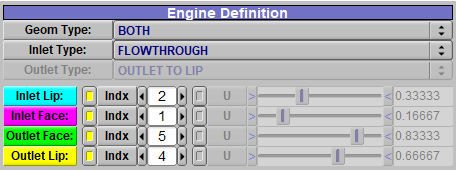

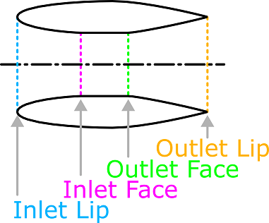

其次是“发动机表示”，它决定分析时采用已定义发动机的哪些部分。完成发动机定义后，仍可从
若干方式中选择如何在分析中表示几何体。

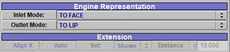

若几何体显式建立了短舱，可将其标记为正体积，也可从分析中移除。除名称以“仅负体积”结尾的
选项外，其余方式都会保留显式短舱；“仅负体积”会舍弃短舱几何体。

若采用隐式流道，可让内部保持为未建模体积，也可将其标记为负体积，在 CompGeom 或 CFD 分析中
从其他正体积中执行布尔切除。还可裁剪流道范围，例如把完整入口/出口流道裁到“端面”，或从
“端面”进一步裁到“唇口”。

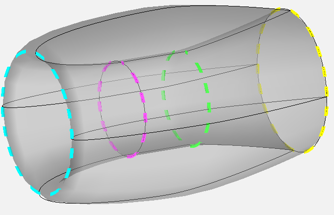

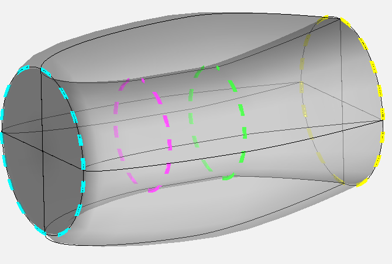

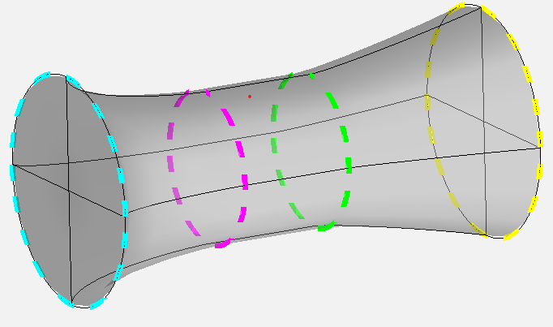

### 出口为原点的贯通短舱

该短舱以“贯通”方式建模，由堆叠截面显式描述短舱内外表面。内部可保持原样，也可标记为
负体积，在 CompGeom/CFD 中切除相交的正体积；还可只保留负体积而忽略短舱本体，或把入口、
出口裁到端面或唇口，使其变为非贯通几何体。

贯通几何体的内表面截面必须从后向前排列，外表面截面必须从前向后排列，以保持正确的曲面法向。
可在该几何体下添加一个使用 UW 平移/旋转附着的空白子几何体，检查其法向是否朝外。
本预设把出口设为截面原点。

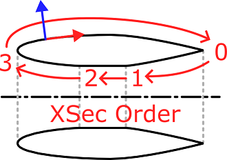

### 入口为原点的贯通短舱

几何和分析行为与上一种贯通短舱相同，但把入口设为截面原点。仍需保证内表面由后向前、
外表面由前向后排列。

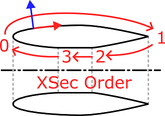

### 中部为原点的贯通短舱

几何和分析行为与其他贯通短舱相同，但把流道中部设为截面原点。除裁到端面或唇口外，
还可以延伸入口或出口；截面顺序和法向要求保持不变。

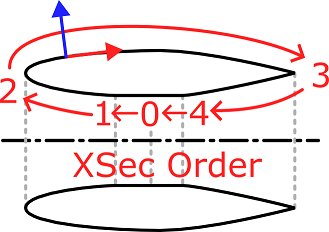

### 入口和出口到端面

从入口端面沿外侧建模到出口端面，不建立两端面之间的贯通区域。入口和出口腔体可按图显示，
也可作为 CompGeom/CFD 使用的负体积；还可用延伸表示覆盖入口或出口。

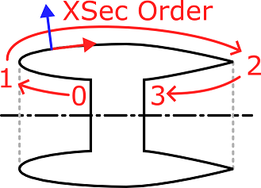

### 入口唇口到出口端面

从入口唇口沿外侧建模到出口端面，不建立端面之间的贯通区域。出口腔体可显式显示或作为负体积，
入口和出口也可改用延伸表示。

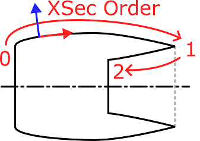

### 入口端面到出口唇口

从入口端面沿外侧建模到出口唇口，不建立端面之间的贯通区域。入口腔体可显式显示或作为负体积，
入口和出口也可改用延伸表示。

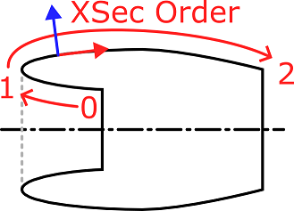

### 入口和出口到唇口

从入口唇口沿外侧建模到出口唇口，不建立两端面之间的贯通区域；入口和出口可采用延伸表示。

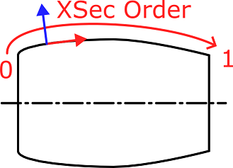

### 出口到端面

仅建立出口到其端面的几何体。出口腔体可显式显示或作为 CompGeom/CFD 的负体积，
出口还可改用延伸表示。

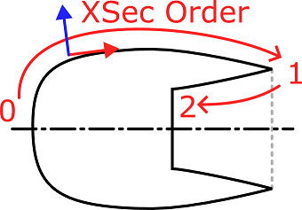

### 出口到唇口

仅建立到出口唇口的出口几何体，并支持出口延伸表示。

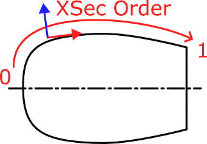

### 入口到端面

仅建立从入口端面开始的入口几何体。入口腔体可显式显示或作为 CompGeom/CFD 的负体积，
入口还可改用延伸表示。

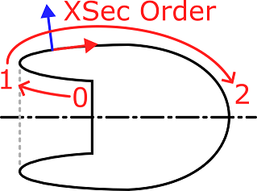

### 入口到唇口

仅建立从入口唇口开始的入口几何体，并支持入口延伸表示。

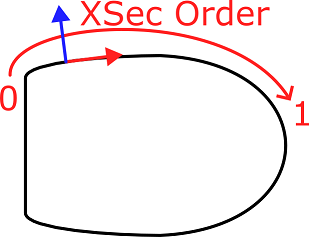

### 入口和出口流道

显式建立内部流道而不建立外部结构。截面顺序与前述短舱相反：入口端面为第一个截面，
沿流道到达出口端面。该表示用于负流道；因为本来就没有短舱，“仅负流道”选项的结果相同。
入口和出口均支持延伸。

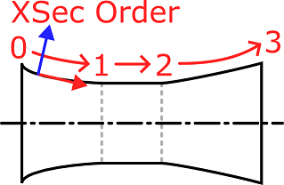

### 入口流道

显式建立从入口唇口到入口端面的内部流道，不建立外部结构。该表示用于负流道；“仅负流道”
选项效果相同，并支持入口延伸。

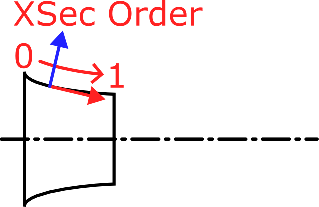

### 出口流道

显式建立从出口端面到出口唇口的内部流道，不建立外部结构。该表示用于负流道；“仅负流道”
选项效果相同，并支持出口延伸。

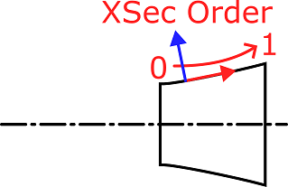
